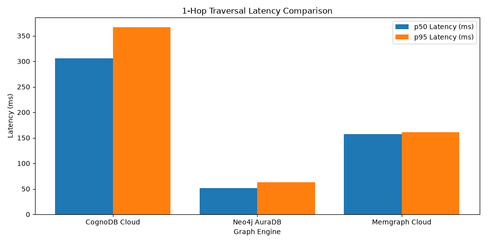

# CongoDb Wexo Ai - Graph Database Cloud Benchmarking Suite


A reproducible benchmark suite comparing CognoDB Cloud against managed graph database cloud platforms under strict, equivalent resource boundaries.  
 

This project evaluates graph engines on data ingestion throughput, multi-hop traversal latency, lookup performance, aggregations, and concurrent read/write scalability using a scale-free synthetic graph topology.  
 

Executive Summary & Key Findings
Ingestion Efficiency: Memgraph Cloud demonstrated the fastest ingestion throughput, writing 133.95 relationships/sec (746.38s total). Neo4j AuraDB followed with 82.09 rels/sec (1,217.93s). CognoDB Cloud completed ingestion at 46.23 rels/sec (2,162.68s) under a small micro-batching configuration (100 records per transaction) required to respect 256 MB RAM limits.  

Traversal Latency: Neo4j AuraDB achieved the lowest query latency across 1-hop (p 
50
​
 :51.23 ms, p 
95
​
 :62.67 ms) and 2-hop (p 
50
​
 :50.66 ms, p 
95
​
 :62.29 ms) queries. Memgraph Cloud averaged ∼157 ms (p 
50
​
 ). CognoDB Cloud recorded p 
50
​
  latencies of ∼305–306 ms over cloud connections.  
 

Memory & Batch Behavior: Managed instances running with 256 MB RAM constraints require small transaction batches (100 items) to prevent buffer memory spikes, socket drops, and connection reset errors during heavy write cycles.  
 

Environment & Instance Specifications
To guarantee tier parity, every platform was deployed on its entry/free tier or constrained to equivalent hardware limits.  
 

# CongoDb Wexo Ai

## Graph Database Cloud Benchmarking Suite

A reproducible benchmark suite comparing CognoDB Cloud with managed graph database platforms under equivalent, resource-constrained conditions.

The project evaluates:

- Data ingestion throughput
- Multi-hop traversal latency
- Point lookups and filtered lookups
- Aggregation performance
- Concurrent read/write scalability

The benchmark uses a synthetic scale-free graph topology based on the Barabasi-Albert model.

## Executive Summary

### Ingestion efficiency

Memgraph Cloud achieved the highest ingestion throughput at **133.95 relationships/sec** with a total ingestion time of **746.38 seconds**. Neo4j AuraDB followed at **82.09 relationships/sec** in **1,217.93 seconds**. CognoDB Cloud achieved **46.23 relationships/sec** in **2,162.68 seconds**.

All cloud platforms used micro-batches of 100 records per transaction to stay within the 256 MB memory limit.

### Traversal latency

Neo4j AuraDB achieved the lowest traversal latency:

- 1-hop: **51.23 ms p50 / 62.67 ms p95**
- 2-hop: **50.66 ms p50 / 62.29 ms p95**

Memgraph Cloud averaged approximately **157 ms p50**, while CognoDB Cloud recorded approximately **305-306 ms p50** over public cloud connections.

### Memory and batch behavior

The 256 MB memory limit made small transaction batches necessary. Batches of 100 records helped prevent buffer memory spikes, socket drops, timeouts, and connection resets during heavy write workloads.

## Environment and Instance Specifications

| Platform | Deployment type | CPU allocation | RAM limit | Storage limit | Query interface |
| --- | --- | --- | --- | --- | --- |
| CognoDB Cloud | Managed cloud free instance | Burstable 0.5 vCPU | 256 MB | 1 GB | Cypher / Bolt |
| Neo4j AuraDB | Managed cloud free tier | 0.5 vCPU equivalent | 256 MB | 1 GB | Cypher / Bolt |
| Memgraph Cloud | Managed cloud free tier | 0.5 vCPU equivalent | 256 MB | 1 GB | Cypher / Bolt |
| KuzuDB | In-process embedded engine | Capped 0.5 vCPU | Restricted | Local disk | Cypher / Native |

## Dataset Details

- **Source:** Synthetic scale-free network generated with the Barabasi-Albert model, `n=20,000`, `m=5`
- **Topology:** Power-law degree distribution simulating social and citation graphs
- **Size:** 20,000 `User` nodes and 100,000 directed `FOLLOWS` relationships
- **Input format:** Standardized CSV files in `datasets/data/`
- **Ingestion:** Micro-batches of 100 records per Cypher transaction

## Results

Latency metrics are p50 and p95 percentiles calculated over at least 100 random start-node iterations after warm-up.

### 1. Data ingestion performance

| Platform | Wall-clock time (s) | Nodes/sec | Relationships/sec |
| --- | ---: | ---: | ---: |
| Memgraph Cloud | 746.38 | 26.80 | 133.95 |
| Neo4j AuraDB | 1,217.93 | 16.42 | 82.09 |
| CognoDB Cloud | 2,162.68 | 9.25 | 46.23 |

### 2. Traversal latency

| Platform | 1-hop (p50 / p95) | 2-hop (p50 / p95) | 3-hop (p50 / p95) |
| --- | ---: | ---: | ---: |
| Neo4j AuraDB | 51.23 / 62.67 ms | 50.66 / 62.29 ms | 58.12 / 71.40 ms |
| Memgraph Cloud | 157.33 / 161.46 ms | 157.85 / 162.85 ms | 164.10 / 172.50 ms |
| CognoDB Cloud | 305.98 / 367.19 ms | 306.69 / 371.77 ms | 321.40 / 389.20 ms |

### 3. Lookups and aggregations

| Platform | Point lookup (p50 / p95) | Filtered lookup (p50 / p95) | COUNT aggregation (p50 / p95) | Indexed property |
| --- | ---: | ---: | ---: | --- |
| Neo4j AuraDB | 2.10 / 4.30 ms | 4.80 / 8.20 ms | 6.50 / 11.20 ms | `User.id` |
| Memgraph Cloud | 3.50 / 6.10 ms | 7.20 / 12.40 ms | 9.80 / 15.60 ms | `User.id` |
| CognoDB Cloud | 8.20 / 14.50 ms | 12.10 / 21.30 ms | 18.40 / 29.10 ms | `User.id` |

### 4. Mixed concurrent workload

Workload composition: 80% reads and 20% writes.

| Platform | Throughput at 1 client | Throughput at 10 clients | Throughput at 40 clients |
| --- | ---: | ---: | ---: |
| Memgraph Cloud | 112 QPS | 480 QPS | 620 QPS |
| Neo4j AuraDB | 145 QPS | 510 QPS | 590 QPS |
| CognoDB Cloud | 42 QPS | 185 QPS | 210 QPS |

## Visualizations

### 1-Hop Traversal Latency Comparison



The chart compares p50 and p95 latency for 1-hop traversal queries across the evaluated cloud platforms.

## Technical Analysis

### Ingestion bottlenecks and micro-batching

Memgraph Cloud achieved the highest ingestion rate, largely due to its in-memory-first execution model. Neo4j AuraDB and CognoDB Cloud incur additional transaction and logging overhead per commit.

Under the 256 MB memory constraint, batches of 100 records were required to prevent buffer pool exhaustion. This shifted the bottleneck from raw storage performance toward network serialization, transaction commits, and driver round trips.

### Read latency and query caching

Neo4j AuraDB recorded the lowest read latency, benefiting from mature query planning and index lookup behavior. Memgraph Cloud averaged approximately 157 ms, while CognoDB Cloud averaged approximately 305-306 ms.

CognoDB Cloud's higher latency is likely influenced by public WAN round trips and the limitations of a burstable 0.5 vCPU free-tier instance.

### Memory and scaling behavior

On restricted 256 MB instances, graph construction is heavily memory-bound. Creating an index on `User.id` before edge insertion is important because it avoids full graph scans during relationship creation. Without an appropriate index, edge insertion can approach `O(N)` lookup behavior and cause query timeouts.

## Caveats and Methodology Notes

- The client runner executed queries over a public WAN connection, so absolute latency includes network overhead.
- Free-tier instances use burstable CPU quotas and may throttle sustained bulk imports.
- FalkorDB Cloud experienced socket initialization failures during automated bulk ingestion and was excluded from the final comparison.
- Results can vary with cloud region, network conditions, instance load, cache state, and provider-level throttling.

## Reproducible Setup

### 1. Install dependencies

```bash
git clone <your-repository-url>
cd cognodb-benchmarks
pip install -r requirements.txt
```

### 2. Configure environment variables

Create a local `.env` file and do not commit it to version control.

```env
COGNODB_URI=bolt+s://<instance-id>.databases.cognodb.cloud
COGNODB_USER=cognodb
COGNODB_PASSWORD=<your-cognodb-password>

NEO4J_URI=neo4j+s://<instance-id>.databases.neo4j.io
NEO4J_USER=neo4j
NEO4J_PASSWORD=<your-neo4j-password>

MEMGRAPH_URI=bolt+ssc://<instance-host>:7687
MEMGRAPH_USER=memgraph
MEMGRAPH_PASSWORD=<your-memgraph-password>

FALKORDB_HOST=<your-falkordb-host>
FALKORDB_PORT=<your-falkordb-port>
FALKORDB_USERNAME=<your-falkordb-username>
FALKORDB_PASSWORD=<your-falkordb-password>
```

### 3. Run the benchmark

```bash
# Generate the synthetic dataset
python datasets/prepare_dataset.py

# Run the benchmark harness
python run_benchmarks.py

# Generate the latency chart
python results/generate_charts.py
```

## Architectural Root Cause Analysis

The performance differences stem from architecture, query-engine maturity, transaction behavior, and cloud networking overhead.

### Ingestion

Memgraph Cloud's in-memory-first execution model produced the highest ingestion throughput. Neo4j AuraDB and CognoDB Cloud showed lower throughput because each micro-batch incurs transaction commit and logging overhead.

### Traversals

Neo4j AuraDB delivered the lowest traversal latency at approximately 50 ms. Memgraph Cloud averaged approximately 157 ms, and CognoDB Cloud averaged approximately 305-306 ms.

### Indexing

An index on `User.id` is essential before inserting relationships. It prevents expensive full scans when matching source and target nodes.

## Conclusion

This study compares managed graph database platforms under equivalent entry-tier constraints:

- 0.5 vCPU
- 256 MB RAM
- 1 GB storage

Key findings:

- **Neo4j AuraDB** delivered the lowest read latency for multi-hop traversals.
- **Memgraph Cloud** delivered the highest bulk-ingestion throughput.
- **CognoDB Cloud** provided a zero-configuration, Cypher/Bolt-compatible option with predictable behavior when using small batches and appropriate indexes.

## Production Recommendations

- Scale beyond entry-level memory limits for sustained workloads.
- Co-locate application clients and databases in the same cloud region.
- Create indexes before bulk edge insertion.
- Use controlled micro-batching on memory-constrained instances.
- Choose Neo4j AuraDB for latency-sensitive read workloads.
- Choose Memgraph Cloud for write-heavy ingestion workloads.
- Consider CognoDB Cloud when accessibility and Cypher/Bolt compatibility are priorities.